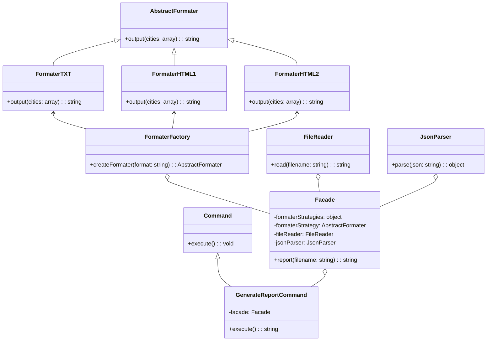

# Arquitetura de Software ES46A
Software desenvolvido seguindo os seguintes critérios:

Com base [nesse sistema](https://github.com/watinha/es46a-2023-2/tree/strategy/01-design-patterns-template-strategy), entregue um repositório onde um padrão de projeto estrutural e um comportamental foi aplicado, e justifique o porquê das escolhas. Além disso seu código e documentação devem apontar três refatorações (use os princípios SOLID). Entregar na documentação também um diagrama de classes final.

# Patterns
### Padrão Estrutural - Facade
O Facade pattern foi aplicado para simplificar a interface do sistema. No código original, a classe  `index.js` estava diretamente acoplada às classes  `FormaterHTML` e `FormaterTXT`, e precisava criar uma instância da classe  `CitiesReporter` para gerar o relatório. Isso aumenta a complexidade do código, pois qualquer mudança na maneira como os relatórios eram manipulados exigiria uma modificação no `index.js`.

Ao introduzir a classe  `Facade`, foi encapsulado toda a lógica de leitura, análise e formatação dos dados em uma única classe. Isso simplifica a interface do sistema, pois agora o `index.js` só precisa criar uma instância da `Facade` e chamar o método `report`. 
 
No código refatorado, a classe `Facade` está agindo como uma fachada para as classes `FormaterFactory`, `FileReader` e `JsonParser`. Assim, o cliente não precisa se preocupar com o que acontece "por baixo dos panos", permitindo que a interação com o sistema aconteça de maneira mais simples.


### Padrão Comportamental - Command
O Command pattern foi aplicado para encapsular a ação de gerar um relatório em um objeto. No código original, a ação de gerar um relatório era realizada diretamente no `index.js`. Isso fazia com que o código se tornasse inflexível e complicado de ajustar, já que qualquer alteração na forma de gerar os relatórios exigiria uma modificação direta no arquivo `index.js`.

Ao encapsular a ação de gerar um relatório na classe `GenerateReportCommand`, o código se tornou mais flexível e dinâmico. Agora, é possível passar a ação de gerar um relatório como um parâmetro, armazená-la em uma variável ou usá-lo em qualquer outra circunstância.

No arquivo `index.js`, dependendo da opção escolhida pelo usuário, uma instância da `Facade` é criada com a estratégia de formatação apropriada e passada para o `GenerateReportCommand`. O método `execute` do comando é então chamado para gerar o relatório. Isso simplifica a interação do usuário com o sistema, pois ele só precisa escolher o formato do relatório e o restante é tratado pela `Facade` e pelo `GenerateReportCommand`.

# Refatorações SOLID:


### Single-responsibility Principle
A classe `CitiesReporter` estava lidando com a leitura e análise do arquivo JSON, além de delegar a formatação dos dados para a estratégia de formatação. Para resolver esse problema de múltiplas funções, foi dividido as responsabilidades em classes separadas. Para isso, foi criado a classe `FileReader` para lidar com a leitura do arquivo e uma classe `JsonParser` para lidar com a análise do JSON, dessa forma, deixando cada classe com uma única responsabilidade.
    
### Open-closed Principle
O código estava preparado para lidar apenas com dois formatos: ‘html’ e ‘txt’. Se fosse necessário adicionar um novo formato, teria que modificar o código existente. Para tornar o código mais aberto para extensão, mas fechado para modificação, a criação das estratégias de formatação foi movida para uma fábrica (`FormaterFactory`) que retorna a estratégia de formatação com base no argumento fornecido, tornando mais fácil adicionar novos formatos sem modificar o código existente.

### Dependency Inversion Principle
No código original, a classe  `CitiesReporter`  estava diretamente acoplada às classes concretas  `FormaterHTML`  e  `FormaterTXT`, ou seja, qualquer mudança nas classes concretas poderia afetar a classe  `CitiesReporter`. Na refatoração, a classe  `Facade`  agora recebe suas dependências (`formaterStrategy`,  `fileReader` e `jsonParser`) como argumentos para o construtor. Com isso, `Facade` agora depende de abstrações, não de classes concretas, tornando o código mais flexível e fácil de modificar, podendo substituir as dependências por diferentes implementações sem ter que alterar a classe  `Facade`.


# Diagrama de Classe:



# Instruções de Uso

Este projeto requer o Node.js para ser executado localmente. Certifique-se de ter o Node.js instalado em sua máquina antes de prosseguir com as seguintes instruções.

### Instalação de Dependências
Abra o terminal e navegue até a pasta raiz do projeto e execute:

```
npm install
```
### Inicie o Servidor
Após a conclusão da instalação das dependências, você pode iniciar o servidor executando o seguinte comando:

```
npm -s start
```